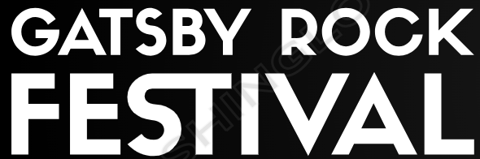

<p align="center">
  <a href="https://gatsbyrockfestival.netlify.app/">
    
  </a>
</p>

<h1 align="center">
  Gatsby Rock Festival App
</h1>

<p align="center">
   Web app de simulação para divulgação e inscrição em um festival de música.
</p>

---

## 🔨 Objetivos

- Aplicar conceitos de arquitetura de front-end com **Gatsby**.
- Implementar um projeto **React** com separação de responsabilidades por componentes.
- Estilizar de maneira **responsiva** para garantir usabilidade em diferentes dispositivos.
- Criar **rotas dinâmicas** geradas a partir de arquivos de marcação (MDX).
- Configurar uma pipeline **CI/CD** para automatizar o processo de build e deploy da aplicação.
- Utilizar **Gatsby Image** para carregamento otimizado de imagens, garantindo uma melhor performance do site.

---

## 🚀 Guia Rápido

Siga os passos abaixo para executar o projeto localmente:

1. **Clone o repositório:**

   ```shell
   git clone https://github.com/vitorggr/gatsbyrockfestival.git
   ```
2. **Instale as dependências:**

   ```shell
   npm install
   ```
3. **Inicie o servidor de desenvolvimento:**

   ```shell
   gatsby develop
   ```
4. **Acesse o aplicativo no navegador:**

  A aplicação estará rodando localmente na porta indicada.
